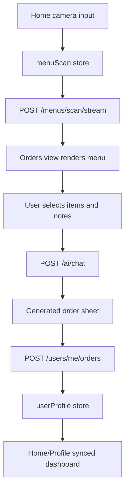

<h1 align="center">TaberuMate - Frontend<br/><a href="../LICENSE">
    
  </a><a href="https://nodejs.org/">
    
  </a><a href="https://vuejs.org/">
    
  </a></h1>

## Overview

This directory contains the TaberuMate mobile-first WebApp. It lets users sign in, scan a menu image, browse the structured menu, filter items by taste or dietary restrictions, generate an AI order sheet, and sync food-profile/history data with the backend.

The UI is designed as an app-like experience rather than a landing page: Home, Orders, and Profile are the primary screens.

## Tech Stack

- Vue 3 + TypeScript
- Vite 8
- Pinia
- Vue Router
- Vant
- Tailwind CSS
- Axios
- lucide-vue-next
- Vitest + Vue Test Utils

## QuickStart

```bash
npm install
cp .env.example .env.development
npm run dev
```

Default local app URL:

- http://127.0.0.1:5173/

The frontend expects the backend API at:

```bash
VITE_API_BASE_URL=http://localhost:8000/api/v1
```

Start the backend from `../backend` before using login, menu scan, AI order generation, profile sync, or order-history features.

## Environment

`VITE_API_BASE_URL` must point to the backend API prefix, not only the backend host:

```bash
VITE_API_BASE_URL=http://localhost:8000/api/v1
```

If Vite chooses another port, the backend CORS config already supports common `517x` local ports through `TABERU_MATE_ALLOWED_ORIGIN_REGEX`.

## App Screens

### Home

- Shows the brand header and menu-scan entry point.
- Requires login before scanning a menu image.
- Displays recent synced orders or food-profile avoidances when available.
- Routes users to the Orders screen after a successful menu scan.

### Orders

- Accepts a menu photo from camera/file input.
- Reads structured menu scan results from `useMenuScanStore`.
- Shows category tabs, item cards, price, availability, allergens, taste details, and confidence scores.
- Filters items by taste and avoidance categories.
- Lets users select quantities and generate an AI order sheet in the chosen target language.
- Saves generated order history through `/users/me/orders` when the user is authenticated.

### Profile

- Supports login and registration.
- Reads dashboard data from `/users/me/dashboard`.
- Lets users edit avoidances, allergies, and common notes through `/users/me/profile`.
- Displays saved profile counts, recent order count, last sync time, and recent order history.

## Frontend Data Flow



## API Clients And Stores

```text
src/services/
├── auth.ts             # register, login, logout, current user
├── authSession.ts      # local access token and CSRF token helpers
├── http.ts             # Axios instance and refresh-token retry
├── menuScan.ts         # streaming menu scan client
├── orderAssistant.ts   # AI order-sheet generation client
└── userProfile.ts      # profile, order history, dashboard client

src/stores/
├── app.ts              # app-level UI state
├── auth.ts             # current user/session state
├── menuScan.ts         # scanned menu result and stream status
└── userProfile.ts      # food profile, recent orders, dashboard stats
```

## Scripts

```bash
npm run dev          # Start Vite dev server
npm run type-check   # Vue/TypeScript checking
npm run test:unit    # Vitest unit tests
npm run build        # Type-check and production build
npm run preview      # Preview production build
npm run lint         # Run configured lint fixers
npm run format       # Format src/ with Prettier
```

Run unit tests once in CI-style mode:

```bash
npm run test:unit -- --run
```

## Project Layout

```text
src/
├── __tests__/          # Vitest tests and setup
├── assets/             # Global CSS
├── router/             # Vue Router routes
├── services/           # API client modules
├── stores/             # Pinia stores
├── views/
│   ├── HomeView.vue
│   ├── OrdersView.vue
│   └── ProfileView.vue
├── App.vue             # App shell and tab bar
└── main.ts             # Vue app bootstrap
```

## Backend Requirements

For the complete frontend workflow, the backend should provide:

- `GET /auth/csrf`
- `POST /auth/register`
- `POST /auth/login`
- `POST /auth/refresh`
- `POST /auth/logout`
- `GET /users/me`
- `GET /users/me/dashboard`
- `PUT /users/me/profile`
- `POST /users/me/orders`
- `POST /menus/scan/stream`
- `POST /ai/chat`

For menu scan demos without an AI key, configure the backend mock response path:

```bash
TABERU_MATE_AI_MENU_SCAN_MOCK_RESPONSE_PATH="/Users/ariakage/Downloads/proj/taberu-mate/temp/1.json"
```

## Testing Notes

The existing tests focus on the app shell and order sheet flow:

- Home screen renders.
- Empty Orders screen prompts for a menu photo.
- Orders screen supports filtering, selecting items, selecting a target language, and generating an AI order sheet.

Run:

```bash
npm run type-check
npm run test:unit -- --run
```

## Troubleshooting

- Login or profile sync fails: confirm the backend is running and `VITE_API_BASE_URL` includes `/api/v1`.
- CSRF errors: the auth client requests `/auth/csrf`; clear local storage and log in again if the token is stale.
- Menu scan returns `401`: log in before uploading a menu photo.
- Menu scan returns `503`: configure AI settings or use the backend mock response path.
- Browser cannot access camera: use HTTPS in production, or use file upload in local development.
